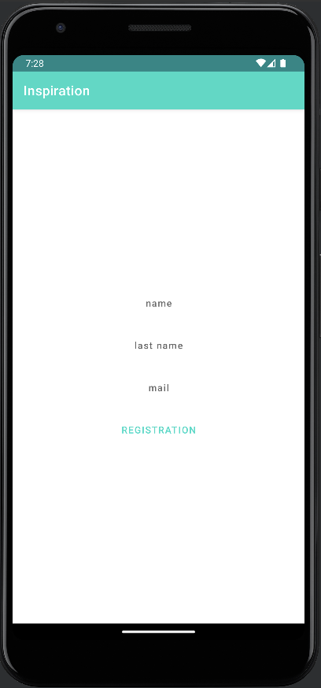
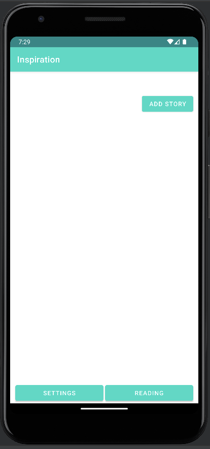
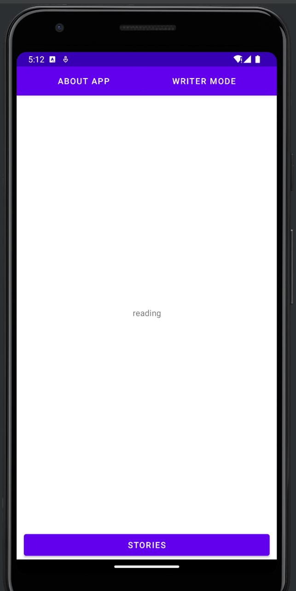
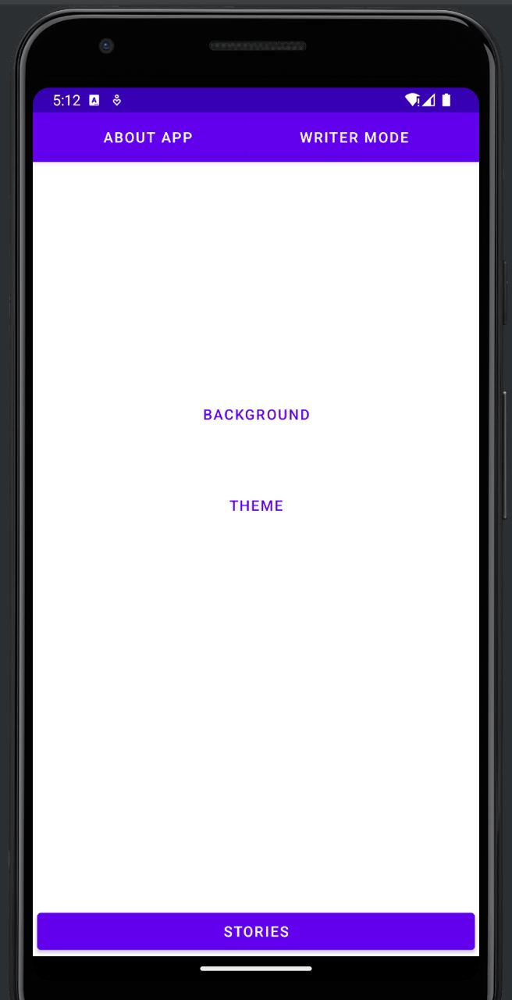
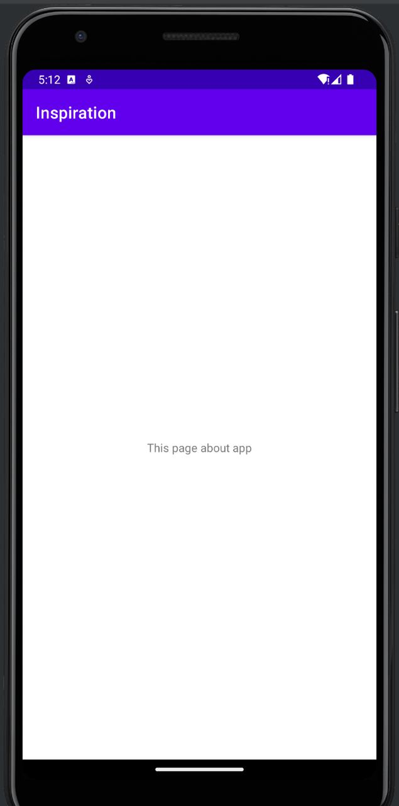
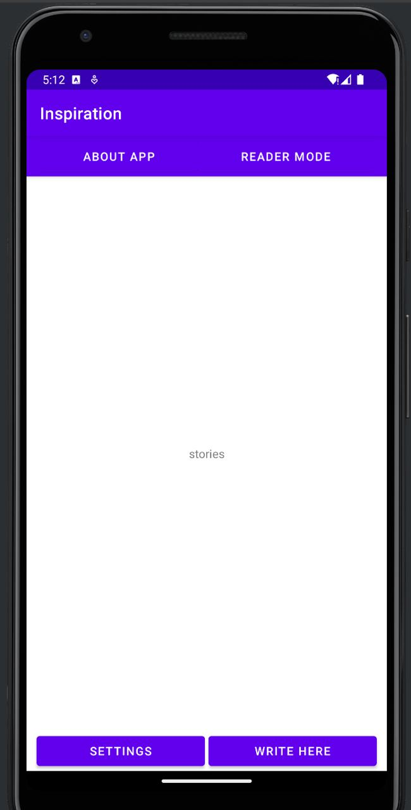
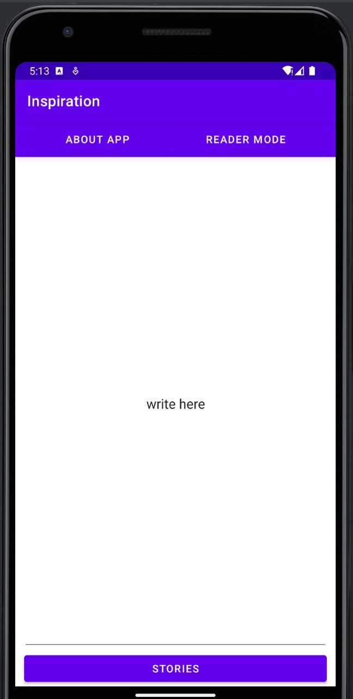

Приложение для написания и выкладывания историй  
(аналог фикбука, литнета, литреса и так далее)  
  
первый экран - регистрация  

далее - экран-контейнер  

главная страница - выложенные истории, кнопка addStory для добавления, листаются вниз  

кнопка reading - читать эту историю, переход на экран для чтения  

кнопка settings - настройки темы и фона для режима читателя  

по кнопке about app переходишь в описание приложения  

по кнопке write mode переходишь в контейнер с аналогичными экранами,  
но уже в режиме писателя  
отображаются те истории, которые сейчас пишутся/были написаны  

по кнопке write here переходишь в продолжение написания данной истории  

